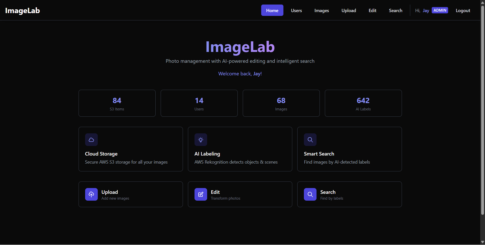
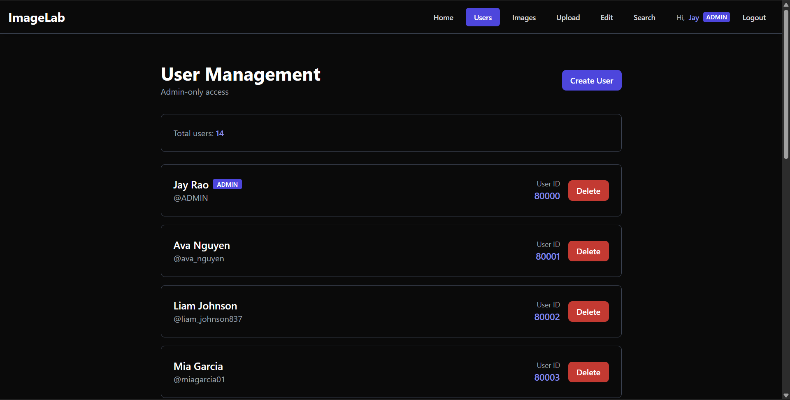
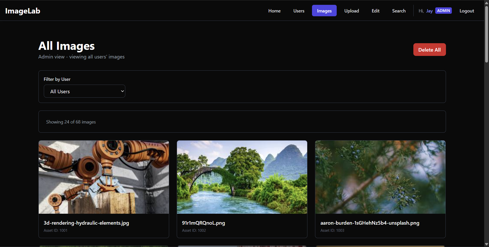
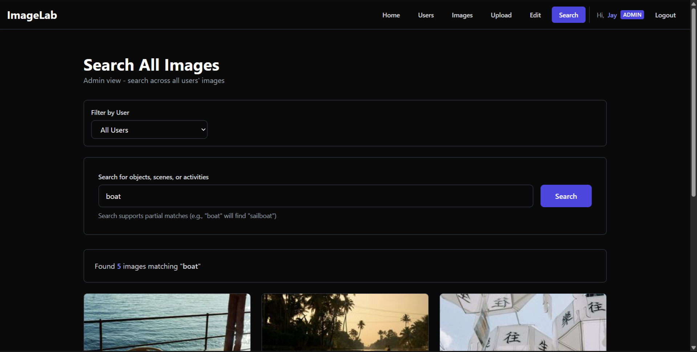
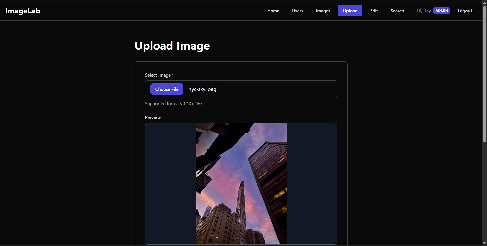

# 🎨 ImageLab

**ImageLab** is a full-stack cloud photo management and editing platform that combines AWS-powered storage and AI labeling with advanced pixel-level image manipulation. Users can upload photos, browse AI-generated labels, search their library, and apply powerful transformations—all in a modern web interface.

---

## 📁 Project Structure

```
ImageLab/
├── backend/                      # FastAPI Python server
│   ├── main.py                   # Application entry point
│   ├── config.py                 # Environment configuration
│   ├── database.py               # MySQL connection handler
│   ├── models.py                 # Pydantic data models
│   ├── aws_services.py           # S3 & Rekognition clients
│   ├── routes/                   # API route handlers
│   │   ├── users.py              # User CRUD operations
│   │   ├── images.py             # Image upload/download/delete
│   │   ├── labels.py             # AI label queries
│   │   ├── edit.py               # Image transformation endpoints
│   │   └── ping.py               # Health check
│   ├── image_processing/         # Core image manipulation engine
│   │   ├── image.py              # Image class with transformations
│   │   ├── pixel.py              # Pixel class for RGB manipulation
│   │   └── util.py               # Helper functions
│   ├── requirements.txt          # Python dependencies
│   ├── Dockerfile                # Backend container configuration
│   └── photoapp-config.ini       # Legacy INI template (placeholders only)
│
├── frontend/                     # Next.js 15 TypeScript app
│   ├── app/                      # App router pages
│   │   ├── page.tsx              # Dashboard home
│   │   ├── login/page.tsx        # User login
│   │   ├── register/page.tsx     # User registration
│   │   ├── users/page.tsx        # User management (admin)
│   │   ├── images/page.tsx       # Image gallery
│   │   ├── upload/page.tsx       # Image upload with AI labeling
│   │   ├── search/page.tsx       # Search by AI labels
│   │   └── edit/page.tsx         # Image editor (15+ transformations)
│   ├── components/               # Reusable UI components
│   │   └── Navigation.tsx        # Top navigation bar
│   ├── lib/                      # Utilities
│   │   ├── api.ts                # API client & TypeScript types
│   │   └── auth.tsx              # Auth context provider
│   ├── package.json              # Node dependencies
│   ├── tailwind.config.js        # TailwindCSS theme
│   ├── next.config.js            # Next.js configuration
│   └── Dockerfile                # Frontend container configuration
│
├── docker-compose.yml            # Multi-container orchestration
├── backend/.env.example          # Backend env template (copy to backend/.env)
└── README.md                     # Project documentation
```

---

## 🚀 Features

### 1. **User Authentication & Management**
- User registration with username, first name, last name, and password
- Secure login with JWT token-based authentication
- Password hashing with SHA-256
- Admin vs regular user roles
- Admin dashboard to view and manage all users
- Delete users and their associated images (admin only)
- User-specific image galleries with privacy isolation

### 2. **Cloud Image Storage**
- Upload images directly to AWS S3
- Automatic unique bucket key generation (UUID-based)
- Secure image storage with AWS IAM credentials
- Download images at any time
- Delete images from both database and S3

### 3. **AI-Powered Labeling**
- **AWS Rekognition** automatically analyzes uploaded images
- Detects objects, scenes, activities, and concepts
- Assigns confidence scores to each label (0-100%)
- Labels stored in MySQL for fast querying
- Search functionality to find images by detected labels

### 4. **Advanced Image Editing**
15+ transformation operations available:

**Color Manipulations:**
- **Add Color** – Add RGB values to all pixels
- **Red/Green/Blue Shift** – Adjust individual color channels
- **Shift Brightness** – Increase/decrease overall brightness
- **Make Monochrome** – Convert to grayscale
- **Negative** – Invert all colors
- **Sepia** – Apply vintage brown tone filter

**Geometric Transformations:**
- **Mirror Horizontal** – Flip left-to-right
- **Mirror Vertical** – Flip top-to-bottom
- **Rotate** – Rotate by 90° increments
- **Tile** – Repeat image in a grid pattern
- **Resize** – Scale to specific dimensions

**Effects:**
- **Blur** – Apply Gaussian blur
- **Pixelate** – Create blocky/retro effect
- **AI Generate** – Create new images from text prompts (Puter.js)

**Workflow Features:**
- Load images from local computer OR cloud gallery
- Apply transformations with live preview
- Download in multiple formats (PNG, JPG, WEBP, BMP)
- Save edited images back to cloud storage
- Replace existing images or save as new

### 5. **Search & Discovery**
- Search images by AI-detected labels
- View all labels for a specific image
- Browse user-specific image collections
- Dashboard with real-time statistics

---

## 🛠️ Technology Stack

### **Backend**
| Technology | Purpose |
|------------|---------|
| **Python 3.12+** | Programming language |
| **FastAPI** | Modern async REST API framework |
| **Uvicorn** | ASGI web server |
| **Pydantic** | Data validation and serialization |
| **PyMySQL** | MySQL database driver |
| **Boto3** | AWS SDK for Python |
| **Pillow (PIL)** | Image processing library |
| **Tenacity** | Retry logic for database operations |

### **AWS Services**
| Service | Purpose |
|---------|---------|
| **AWS S3** | Object storage for images |
| **AWS Rekognition** | AI image analysis and labeling |
| **AWS RDS MySQL** | Managed relational database |
| **AWS IAM** | Access key management |

### **Frontend**
| Technology | Purpose |
|------------|---------|
| **Next.js 15** | React framework with App Router |
| **React 19** | UI component library |
| **TypeScript** | Type-safe JavaScript |
| **TailwindCSS** | Utility-first CSS framework |
| **Fetch API** | HTTP client for API calls |

### **DevOps & Deployment**
| Technology | Purpose |
|------------|---------|
| **Docker** | Containerization |
| **Docker Compose** | Multi-container orchestration |
| **Render** | Backend deployment (FastAPI) |
| **Vercel** | Frontend deployment (Next.js) |

---

## 🏗️ Architecture

### **System Overview**
```
┌──────────────────────────────────────────────┐
│              Browser / User                  |
└─────────┬────────────────────────────────┬───┘
          │                                │
          │ HTTPS (REST API)               │ HTTPS (Puter.js)
          ▼                                ▼
┌─────────────────────┐            ┌─────────────────┐
│   Next.js Frontend  │            │   Puter.js API  │
│     (React App)     │            │ (AI Generation) │
└──────────┬──────────┘            └─────────────────┘
           │
           │ REST API (JWT Auth)
           │
           ▼
┌─────────────────────┐
│  FastAPI Backend    │
│   (Python Server)   │
└──┬────────┬────────┬┘
   │        │        │
   │        │        └─────────┐
   │        │                  │
   │        │ AWS SDK          │ AWS SDK
   ▼        ▼                  ▼
┌──────┐ ┌─────────┐   ┌────────────────┐
│AWS S3│ │AWS RDS  │   │AWS Rekognition │
│Images│ │(MySQL)  │   │  (AI Labels)   │
└──────┘ └─────────┘   └────────────────┘
```

**Data Flow:**
1. **User Authentication**: Browser → Next.js → FastAPI (JWT tokens)
2. **Image Upload**: Browser → Next.js → FastAPI → S3 + Rekognition → MySQL
3. **Image Download**: Browser → Next.js → FastAPI → S3
4. **AI Generation**: Browser → Next.js → Puter.js (direct, no backend)
5. **Image Editing**: Browser → Next.js → FastAPI (pixel manipulation) → Browser
6. **Search/Labels**: Browser → Next.js → FastAPI → MySQL

### **API Routes**

#### **Health**
- `GET /ping` – Server health check

#### **Authentication**
- `POST /auth/register` – Register new user
- `POST /auth/login` – Login with username/password (returns JWT)
- `GET /auth/me` – Get current user info from JWT
- `POST /auth/set-password` – Change user password

#### **Users**
- `GET /users` – List all users
- `POST /users` – Create new user (deprecated - use /auth/register)
- `DELETE /users/{userid}` – Delete user and their images

#### **Images**
- `GET /images` – List all images (optional `?userid=N` filter)
- `POST /images` – Upload image (triggers S3 upload + Rekognition)
- `GET /images/{assetid}` – Download image file
- `DELETE /images/{assetid}` – Delete image from S3 and database
- `DELETE /images?userid=N` – Delete all images for a specific user (admin can target, users delete their own)

#### **Labels**
- `GET /labels/image/{assetid}` – Get all labels for an image
- `GET /labels/search?label={name}` – Search images by label
- `GET /labels/count` – Get total label count

#### **Edit**
- `POST /edit/apply` – Apply transformation to image
- `POST /edit/save` – Save edited image to cloud storage

---

## 🎯 How It Works

### **1. Image Upload Flow**
1. User selects image file in Upload page
2. Frontend sends multipart form data to `POST /images`
3. Backend generates unique bucket key (UUID)
4. Image uploaded to S3 bucket
5. AWS Rekognition analyzes image for labels
6. Labels (with confidence scores) stored in database
7. Image metadata saved to `assets` table
8. Frontend displays success message

### **2. AI Labeling Process**
- When image is uploaded, backend calls `detect_labels()` on Rekognition
- Rekognition returns up to 50 labels with confidence scores (0-100)
- Each label stored in `imagelabels` table with `assetid` reference
- Labels can be searched using `/labels/search` endpoint
- Example labels: "Person", "Sunset", "Dog", "Mountain", "Food"

### **3. Image Editing Workflow**
1. User loads image from computer or cloud gallery
2. Selects transformation (e.g., "Blur", "Sepia", "AI Generate")
3. Configures parameters (amount, size, color values, prompt)
4. For non‑AI transforms, frontend sends request to `POST /edit/apply`
5. Backend:
  - Loads image from S3 (if from gallery) or upload
  - Converts to internal `Image` class (pixel matrix)
  - Applies transformation using `image_processing` module
  - Converts back to PIL Image
  - Returns transformed image as PNG stream
6. For AI generation, frontend uses **Puter.js** directly and renders the result locally
7. Frontend displays preview
8. User can download or save to cloud storage

### **4. Image Processing Engine**
Custom pixel-level manipulation system:
- **Image class** – Stores 2D matrix of Pixel objects
- **Pixel class** – RGB values (0-255) with clamping
- Transformations iterate over pixel matrix applying operations
- Supports loading/saving BMP, PNG, JPG, WEBP formats
- AI generation uses Puter.js API for text-to-image (frontend-based, free unlimited)

---

## 📊 Database Schema

### **users**
| Column | Type | Description |
|--------|------|-------------|
| userid | INT (PK, AUTO) | Unique user ID |
| username | VARCHAR(64) | Username (unique) |
| givenname | VARCHAR(64) | First name |
| familyname | VARCHAR(64) | Last name |
| pwdhash | VARCHAR(256) | SHA-256 hashed password |
| is_admin | TINYINT(1) | Admin flag (0 or 1) |

### **assets**
| Column | Type | Description |
|--------|------|-------------|
| assetid | INT (PK, AUTO) | Unique image ID |
| userid | INT (FK) | Owner user ID |
| localname | VARCHAR(255) | Original filename |
| bucketkey | VARCHAR(255) | S3 object key (UUID) |

### **image_labels**
| Column | Type | Description |
|--------|------|-------------|
| labelid | INT (PK, AUTO) | Unique label ID |
| assetid | INT (FK) | Associated image |
| label | VARCHAR(64) | Detected object/scene |
| confidence | DECIMAL(5,2) | AI confidence (0-100) |

---

## 🔧 Configuration

### **Environment Variables**

Copy [backend/.env.example](backend/.env.example) to backend/.env and fill in your credentials.

**Backend** (`backend/.env`):
```env
# CORS - comma-separated list of allowed frontend origins
ALLOWED_ORIGINS=http://localhost:3000,https://your-app.vercel.app

RDS_ENDPOINT=your-db.us-east-2.rds.amazonaws.com
RDS_PORT=3306
RDS_REGION=us-east-2
RDS_USERNAME=YOUR_USERNAME
RDS_PASSWORD=YOUR_PASSWORD
RDS_DATABASE=photoapp

S3_BUCKET_NAME=YOUR_BUCKET_NAME
S3_REGION=us-east-2

S3_READONLY_REGION=us-east-2
S3_READONLY_ACCESS_KEY=YOUR_ACCESS_KEY
S3_READONLY_SECRET_KEY=YOUR_SECRET_KEY

S3_READWRITE_REGION=us-east-2
S3_READWRITE_ACCESS_KEY=YOUR_ACCESS_KEY
S3_READWRITE_SECRET_KEY=YOUR_SECRET_KEY
```

**Frontend** (`.env.local`):
```env
NEXT_PUBLIC_API_URL=http://localhost:8000
```

---

## 🐳 Running with Docker

```bash
# Start both frontend and backend
docker-compose up --build

# Access application
# Frontend: http://localhost:3000
# Backend API: http://localhost:8000
# API Docs: http://localhost:8000/docs
```

---

## 🌐 Deployment

### **Backend (Render)**
- Deploy FastAPI application to Render
- Configure environment variables for AWS credentials
- Enable CORS for Vercel domain

### **Frontend (Vercel)**
- Deploy Next.js application to Vercel
- Set `NEXT_PUBLIC_API_URL` to Render backend URL
- Automatic builds on git push

---

## 📦 Dependencies

### **Backend** (`requirements.txt`)
```
fastapi
uvicorn[standard]
python-multipart
pillow
boto3
pymysql
pydantic
tenacity
requests
PyJWT
```

### **Frontend** (`package.json`)
```json
{
  "dependencies": {
    "next": "15.1.4",
    "react": "^19.0.0",
    "react-dom": "^19.0.0",
    "typescript": "^5"
  },
  "devDependencies": {
    "tailwindcss": "^3.4.1",
    "postcss": "^8",
    "autoprefixer": "^10.0.1"
  }
}
```

---

## 📷 Screenshots

<div align="center">

### Application Interface

<table>
  <tr>
    <td align="center"><b>Dashboard</b><br></td>
    <td align="center"><b>User Management</b><br></td>
  </tr>
  <tr>
    <td align="center"><b>Image Gallery</b><br></td>
    <td align="center"><b>Label Search</b><br></td>
  </tr>
  <tr>
    <td align="center"><b>Image Editor</b><br></td>
    <td align="center"><b>Upload Page</b><br></td>
  </tr>
</table>

</div>

## 🎨 UI Design

- **Dark Theme**: #0a0a0a background
- **Accent Color**: Indigo-600 (#4f46e5)
- **Borders**: Gray-700 with transparent backgrounds
- **Typography**: System font stack
- **Responsive**: Mobile-first TailwindCSS grid layouts

---

## 🔐 Security Considerations

- AWS credentials stored in config file (not in version control)
- IAM policies restrict S3 and Rekognition access
- CORS configured for specific frontend domains
- SQL injection prevention via parameterized queries
- File upload validation for image types

---


### Built by Jay Rao